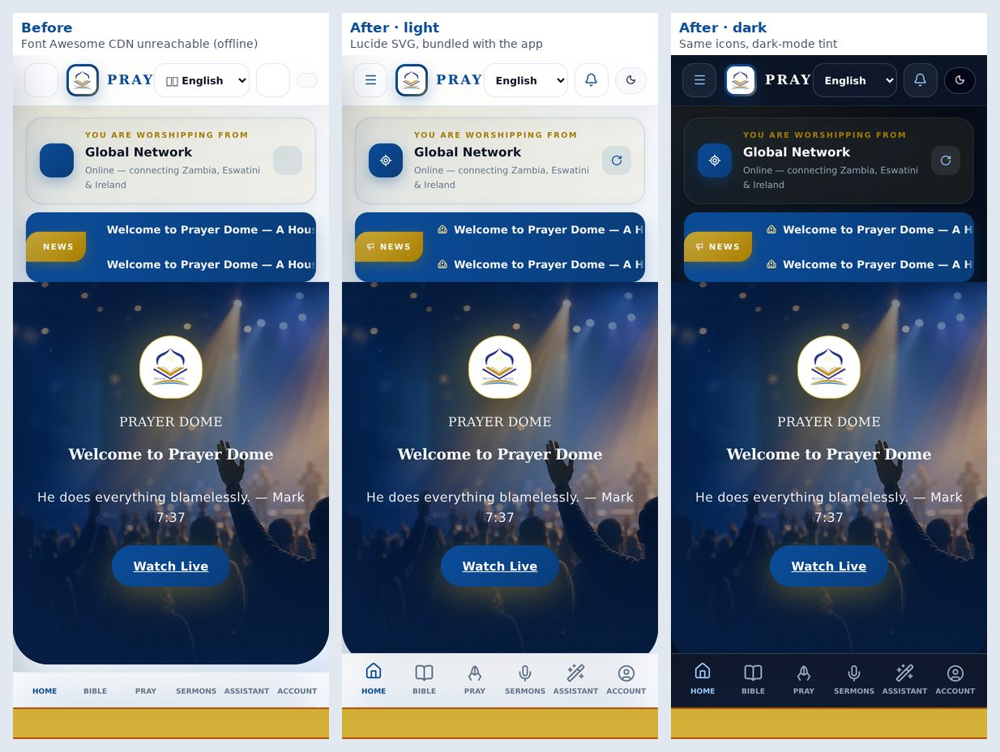
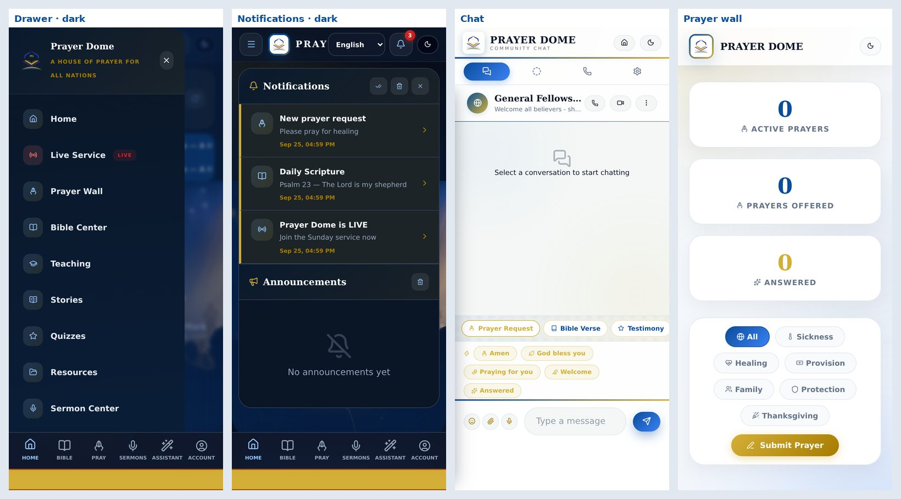
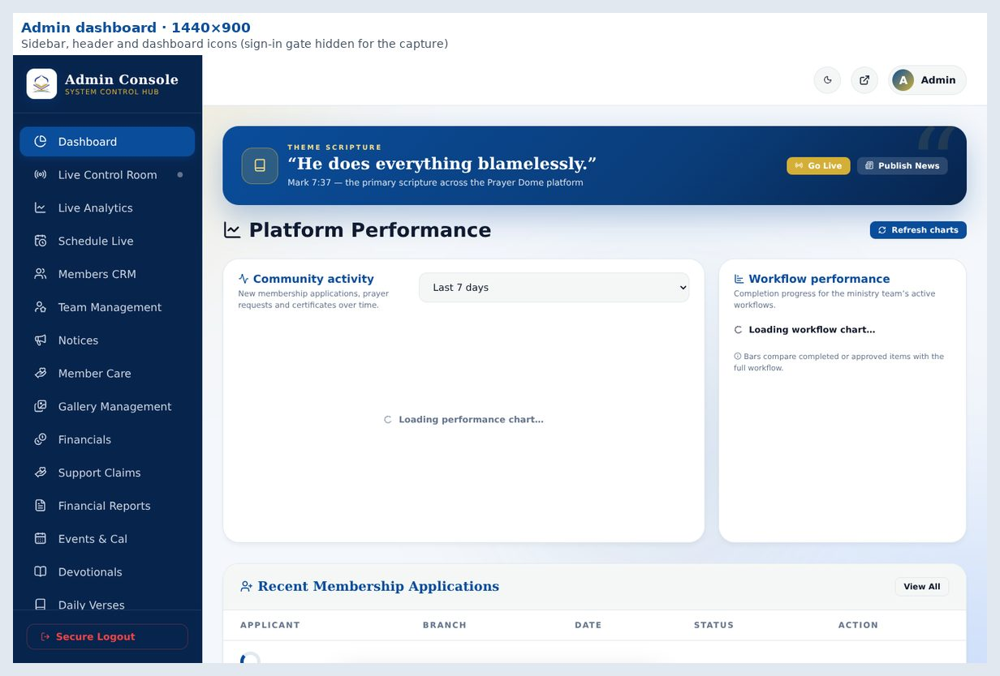
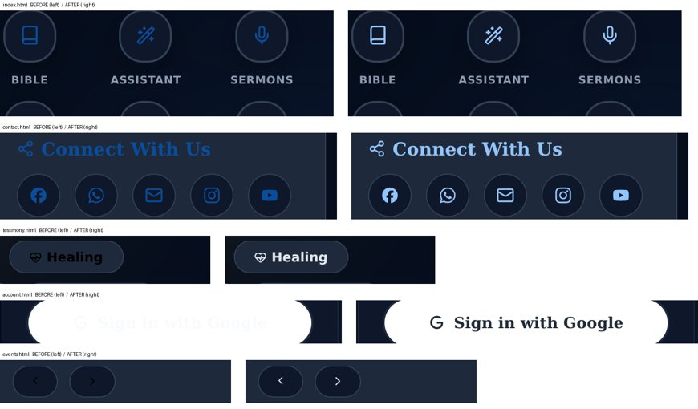

# Prayer Dome UI upgrade: icon system report

Every emoji and icon font used as a UI icon has been replaced with a single
SVG icon library: **[Lucide](https://lucide.dev)**. The icons are bundled
with the app, scale cleanly on any screen, follow light and dark mode, and work
offline.

## Summary

| Required metric | Result |
|---|---|
| **Total emojis found** | **682** emoji and emoji-like icon symbols (108 distinct) in 37 UI source files |
| **Total icons replaced** | **2,179**: 1,956 Font Awesome icon references and 223 emoji used as icons now draw Lucide SVGs |
| **Emoji left in the UI** | **0**. The 48 keys of the chat emoji keyboard remain on purpose, because they insert emoji into a member's message |
| **Screens / pages updated** | **35 of 35 pages**, plus the shared app shell, Academy, live streaming, uploads, certificates, notifications, service workers and push functions |
| **Remaining UI inconsistencies** | 9 known items, all listed [below](#remaining-ui-inconsistencies). None of them is a broken or missing icon |

## Screenshots

**Home, before and after.** The "before" capture ran with the Font Awesome
CDN unreachable, as happens offline or on a blocked network. The icons were
blank and the flag in the language picker showed as a box.

**Drawer and notifications in dark mode, chat, and the prayer wall** (390×844):

**Admin dashboard at 1440×900:**

**Dark-mode fixes found by the contrast scan** (left: before, right: after):
home portal grid, contact headings and social links, testimony filter chips,
"Sign in with Google", and the events calendar arrows.

## The icon system

- **One library.** Lucide v1.48.0 (ISC licence), with canonical names. Lucide
  has no praying hands and its `cross` is equal-armed, so `hands-praying` and
  `latin-cross` were drawn on the Lucide 24px grid with its 2px round stroke.
  Social logos (WhatsApp, Facebook, X, Telegram, Instagram, YouTube, Google)
  use Simple Icons marks (CC0) as `brand-*`.
- **Markup:** `<i class="pd-i pd-i-bell" aria-hidden="true"></i>`. Each icon
  is a 1em SVG mask painted with `currentColor`. `font-size` sets its size,
  text colour sets its colour, and it adapts to light and dark mode, Windows
  high-contrast mode and print.
- **Sizes:** `pd-i-xs | sm | lg | 2x–5x`, with `pd-i-fw` for fixed width and
  `pd-i-spin` for loaders. Filled variants (`-fill`) exist for the rating,
  bookmark, heart, play and status dot.
- **Generated, not hand-written.** `npm run build:icons` scans the source and
  writes `assets/pd-icons.css` and `assets/pd-icons.js` with only the icons in
  use: 277 icons, 266 of them referenced by the app. Unknown names fail the
  build, `npm run lint` fails on stale output, and `tests/icons.test.js` (42
  checks) keeps the rules below enforced.
- **Older data keeps working.** Older Android builds read the same Firestore
  data. `PDIcons.cls()` therefore resolves 317 legacy Font Awesome names and
  101 legacy emoji to Lucide icons, and a small observer upgrades any legacy
  Font Awesome markup (for example from a script still cached during a
  deploy).
- Maintainer guide: [DEVELOPMENT.md → Icon system](DEVELOPMENT.md#icon-system).

### Requested mapping

| Feature | Lucide icon | Uses | | Feature | Lucide icon | Uses |
|---|---|---|---|---|---|---|
| Home | `house` | 24 | | Donations | `heart-handshake`, `gift` | 1, 6 |
| Prayer requests | `hands-praying` | 70 | | Media | `circle-play` | 10 |
| Bible | `book` | 40 | | Music | `music` | 17 |
| Daily verse | `book-open` | 37 | | Search | `search` | 10 |
| Live stream | `radio`, `radio-tower` | 23, 8 | | Groups | `users` | 26 |
| Notifications | `bell` | 24 | | Community | `users-round` | 2 |
| Messages | `message-circle` | 8 | | Video / audio | `video`, `headphones` | 12, 4 |
| Profile | `user`, `circle-user` | 31, 14 | | Downloads / uploads | `download`, `upload` | 15, 2 |
| Settings | `settings` | 1 | | Security | `shield` | 15 |
| Events | `calendar`, `calendar-days` | 22, 17 | | Admin | `shield-check` | 2 |

## Metric details

### Emoji found: 682

The audit covered all UI source: 34 pages, the documents hub, shared scripts
and styles, data files, service workers, the API and Cloud Functions push text.
It counted pictographic emoji (with variation selectors, skin tones and ZWJ
sequences as one), flag pairs, and the typographic symbols used as icons
(✓ ✗ ✕ ★ ☆ ♪ ▶ ●). The ©, ® and ™ signs and plain arrows are text and were
not counted.

- 682 occurrences: 646 emoji (including 68 flag pairs) and 36 icon symbols.
- Most frequent: 🙏 61, ✅ 38, 🔥 30, ✨ 29, 📖 28, ❤️ 28, ✓ 23.
- Heaviest files: chat 175, admin 140, membership 37, prayer 36, video 35,
  live 34, testimony 31, game 25, account 19, Academy 19.
- A broader raw scan that also includes docs and tests finds 804.

### What happened to each of the 634 removed emoji

| Outcome | Count |
|---|---:|
| Replaced by a Lucide SVG icon (markup, icon maps, CSS pseudo-element masks) | 223 |
| Removed as a duplicate of an icon already beside it | 37 |
| Removed from `<select>` option labels (native controls cannot show SVG) | 100 |
| Removed from toasts, which already show a typed success or error icon | 87 |
| Removed from flag text (flags render as blank boxes on many Android and Windows fonts) | 17 |
| Removed from push, notification and page titles | 11 |
| Removed from native `alert` and `confirm` dialogs | 11 |
| Removed from share, WhatsApp and clipboard text | 4 |
| Removed from other decorative text (headings, system chat messages, labels, console) | 139 |
| Kept as `\u{…}` data codes for reactions saved by older app builds | 5 |
| **Total** | **634** |

These counts come from a script that diffs every UI file against the base
commit. The 223 is a lower bound, because a few replacements moved to other
lines. The flag options for language and branch pickers are now text only, and
the admin language cards show a code badge (EN, TUM, …).

### Icons replaced: 2,179

- **Font Awesome: 1,956 icon references in 41 files.** The app loaded two
  different versions from a CDN (6.4.0 on 25 pages, 6.5.1 on 6). All 32
  stylesheet links are gone, along with about 20 KB of CSS and 150–290 KB of
  web fonts per first visit. The 317 names used map to 252 Lucide icons.
- **Emoji: 223** icons, as detailed above.
- The source now holds 2,173 icon references across 266 distinct icons. A
  runtime audit of all 35 pages rendered 1,693 icons at 390×844, with none
  missing.

### Screens and pages updated: 35 of 35

| Area | Pages and modules |
|---|---|
| Navigation and shell | app header, drawer menu, bottom navigation, notifications panel, announcement bar, location card, toasts, splash (`pd-app.js`, `pd-brand.css`) |
| Prayer | `prayer`, `ai-prayer`, `testimony`, `index` (weekly challenge, daily devotional) |
| Bible and learning | `bible`, `lessons`, `quiz`, `resources`, `resource-view`, `stories`, `documents/`, Academy (`pd-academy.js`), certificates |
| Media and live | `live`, `video`, `ai-video`, `radio`, `sermons`, `gallery`, `pd-live-webrtc.js`, `pd-upload.js` |
| Community | `chat`, `news`, `events`, `event`, `team`, `game` |
| Giving and membership | `give`, `finance`, `membership` |
| Profile, settings, security | `account`, `privacy`, `support`, `contact`, `about`, `translate` |
| Admin dashboard | `admin` (sidebar, stat cards, tables, live studio, content managers) |
| System | `404`, `offline`, `sw.js` (precache v19), `firebase-messaging-sw.js`, `functions/index.js` (push text), `api/radio.js` |

## Standardization and fixes

- **Duplicate icon styles removed.** Two Font Awesome versions and ad-hoc
  emoji sizing gave way to one class API with one sizing scale, drawn on a
  single 24px grid and stroke. Nav bar, sidebar, header, settings, profile and
  dashboard icons now share it.
- **Broken icons fixed:**
  - Font Awesome Pro-only names had rendered blank: `calendar-star` ×6,
    `shield-check` and `house-chimney-heart`.
  - The 404, offline and privacy toasts never loaded the Font Awesome
    stylesheet, so their icons were blank.
  - With the CDN unreachable (offline or on blocked networks), every icon
    disappeared. Icons are now bundled and precached.
  - An admin publish/hide toggle built the non-existent name `eye-slash`.
  - Live-page offline icons were oversized, and a white icon sat on a white
    circle in the journey map in dark mode.
  - Flag emoji showed as blank boxes.
- **Dark mode.** A pixel-based contrast scan of every icon in both themes
  measured each glyph against the real background beneath it. On the pages
  where dark mode can be switched on, it found 43 groups of icons below 3:1.
  - Brand blue (#0A4D9B) was about 2:1 on navy in the drawer, header buttons,
    notifications, home grid, bottom navigation, card headings, Academy tiles
    and assistant topics.
  - Unstyled chips and calendar buttons painted black icons and labels on
    navy.
  - "Sign in with Google" was white on white.
  - Fixes use the existing dark-mode tint (#93c5fd) and leave light mode
    unchanged. 8 groups remain, all white icons on gold or WhatsApp-green
    buttons whose label text has the same contrast (see below).
  - The chat composer's icon-only buttons moved to deep gold (#a67c00) in light
    mode, from 1.95:1 to about 3.5:1.
- **Accessibility.** All 209 icon-only buttons and links have an accessible
  name; 113 of them had none before. Screen readers used to read emoji aloud
  ("folded hands"), while SVG icons are silent, so decorative icons are
  `aria-hidden` and actions are labelled.
- **Safety.** Chat room names and descriptions are now rendered as text, which
  closes an XSS path. The video page escapes avatar initials, and the star
  rating clamps its value and has an `aria-label`.

## Performance

| | Before | After |
|---|---|---|
| Icon requests | CDN stylesheet plus 1–3 web fonts per page | 2 same-origin files, cached by the service worker |
| Icon payload | about 20 KB CSS and 150–290 KB fonts | 19.6 KB CSS + 6.6 KB JS gzipped (122 KB + 19 KB raw) |
| Offline | icons blank | icons work offline |
| Rendering | web-font swap and blank icons until the font loaded | each icon reserves its 1em box immediately, with no font loading |

## Verification

- `npm test` passes all suites, including the new `tests/icons.test.js`.
  `npm run lint` passes and now includes the icon build check.
  `npm run functions:verify` passes.
- The icon tests were mutation-checked: planting an emoji, a Font Awesome
  link or class, a page without the icon files, an unknown or spliced icon
  name, a bare icon, an unlabelled icon button or a stale stylesheet each
  fails the suite.
- Runtime audit in headless Chromium, the engine behind Android WebView and
  Chrome: all 35 pages in light and dark mode with no missing icons, no legacy
  classes, no emoji, no oversized or undersized icons in controls, and no
  JavaScript errors.
- Screens were checked at 360×800 and 390×844 (phones), 820×1180 (tablet) and
  1440×900 (desktop).
- iPhone and iPad (Safari/WebKit) were not tested on a device. The CSS ships
  both `-webkit-mask-*` (Safari 4+) and standard `mask-*` (Safari 15.4+)
  properties.

## Remaining UI inconsistencies

None of these is a broken or missing icon. All predate this work or are
kept for compatibility on purpose.

1. **White text on gold and WhatsApp-green buttons** is about 2.3–2.5:1 for
   text and icon alike: Submit Prayer, Read Chapter, Share Your Story, the
   News label and the founder title. Fixing it is a brand palette decision
   (for example a deeper gold) rather than an icon change.
2. **Gold accents in light mode** are about 2:1. This covers the gold icons
   beside headings, and the chat suggestion chips, whose gold labels have the
   same contrast. They are decorative, the adjacent text carries the meaning,
   and they are kept as the brand look.
3. **Dark mode is inconsistent across pages.** The theme button on
   `lessons`, `resources` and `stories` calls a `toggleDarkMode` function that
   is not defined. Ten pages have no theme toggle. Only `ai-prayer`, `sermons`
   and `translate` remember the choice.
4. The **live page "Upcoming Lives" / "Past Lives" titles** have low contrast
   in light mode.
5. **Saved content keeps its emoji.** Older chat and system messages, and
   anything members or staff type, display as saved. Notification titles and
   cached labels drop a leading emoji.
6. **Reaction keys and custom group icons** are still stored as emoji codes in
   Firestore so older app builds keep working. The app draws them as icons.
7. The **Google sign-in mark** is monochrome. Google's branding guidelines
   prefer the four-colour "G".
8. **Typographic arrows (→)** inside sentences were left as text.
9. **Caching.** JS and CSS are unversioned and cached for 7 days. Bump
   `CACHE_NAME` in `sw.js` whenever icons change. The legacy upgrader covers
   scripts that are still stale during a deploy.
